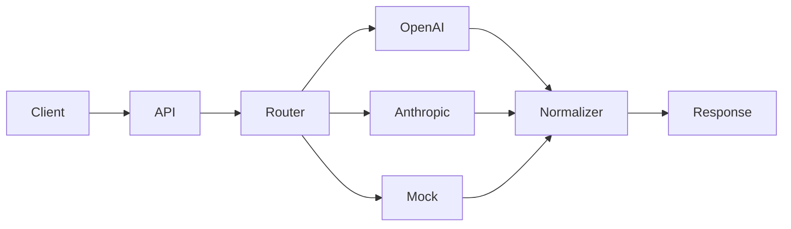

# LLM Routing Engine

## Note

This repository demonstrates system architecture and engineering patterns inspired by real-world product development. The production implementation remains private.

---

## 🚀 Overview

A production-inspired backend system for routing requests across multiple AI providers with fallback logic and response normalization.

Designed to demonstrate:

* multi-model AI integration
* provider abstraction
* fallback strategies
* clean backend architecture

---

## 🧠 What this demonstrates

* Designing resilient multi-provider AI systems
* Structuring backend services for extensibility
* Handling failure and fallback in distributed systems
* Normalizing heterogeneous AI responses into a unified interface

This pattern is commonly used in AI-powered products that require reliability across multiple providers and consistent response formats.

---

## 🏗️ Architecture



---

## 📦 Repository Summary

This is a FastAPI service that demonstrates how to structure a backend system when working with multiple LLM providers.

The system accepts a chat-style request, routes it through a provider selection and fallback mechanism, and returns a normalized response regardless of which provider handled the request.

The design emphasizes:

* clear separation of concerns
* modular provider adapters
* consistent response formatting
* testable service layers

---

## ⚡ Key Capabilities

* Multi-provider LLM routing (OpenAI, Anthropic, mock)
* Configurable fallback strategy
* Normalized response format across providers
* Clean service-layer architecture
* Typed request/response validation with Pydantic
* Async HTTP handling with timeouts

---

## 🚫 Non-goals

This is not a full API gateway. The following are intentionally excluded:

* Streaming responses
* Authentication / authorization
* Billing / usage tracking
* Distributed rate limiting

These can be layered on top in a production environment.

---

## 🧰 Stack

* Python 3
* FastAPI
* Pydantic v2
* httpx (async HTTP)
* pytest

---

## 📁 Project Structure

```text
llm-routing-engine/
├── app/
│   ├── main.py
│   ├── api/chat.py
│   ├── core/
│   ├── schemas/chat.py
│   ├── services/
│   │   ├── router.py
│   │   ├── normalizer.py
│   │   └── providers/
│   └── utils/errors.py
├── docs/architecture.md
├── tests/
├── .env.example
├── requirements.txt
└── README.md
```

---

## ⚙️ Quick Start

```bash
python -m venv .venv
source .venv/bin/activate   # Windows: .venv\Scripts\activate

pip install -r requirements.txt

cp .env.example .env

uvicorn app.main:app --reload
```

* API: http://127.0.0.1:8000
* Docs: http://127.0.0.1:8000/docs

---

## 🔌 API Overview

### GET /health

Returns service status and available providers.

### POST /chat

Accepts:

* message
* preferred_provider
* allow_fallback
* temperature
* max_tokens

Returns:

* normalized response
* provider used
* fallback status
* latency metadata

---

## 🧪 Testing

```bash
pytest tests/ -v
```

Includes:

* API tests
* fallback behavior tests
* async router tests

---

## 📚 Documentation

See `docs/architecture.md` for:

* request lifecycle
* routing logic
* design decisions
* extension points

---

## 🚀 Possible Extensions

* streaming responses
* distributed rate limiting
* circuit breakers (e.g. Redis-backed)
* metrics and observability
* authentication & multi-tenant support

---

## 📄 License

Add a LICENSE file if distributing publicly.
